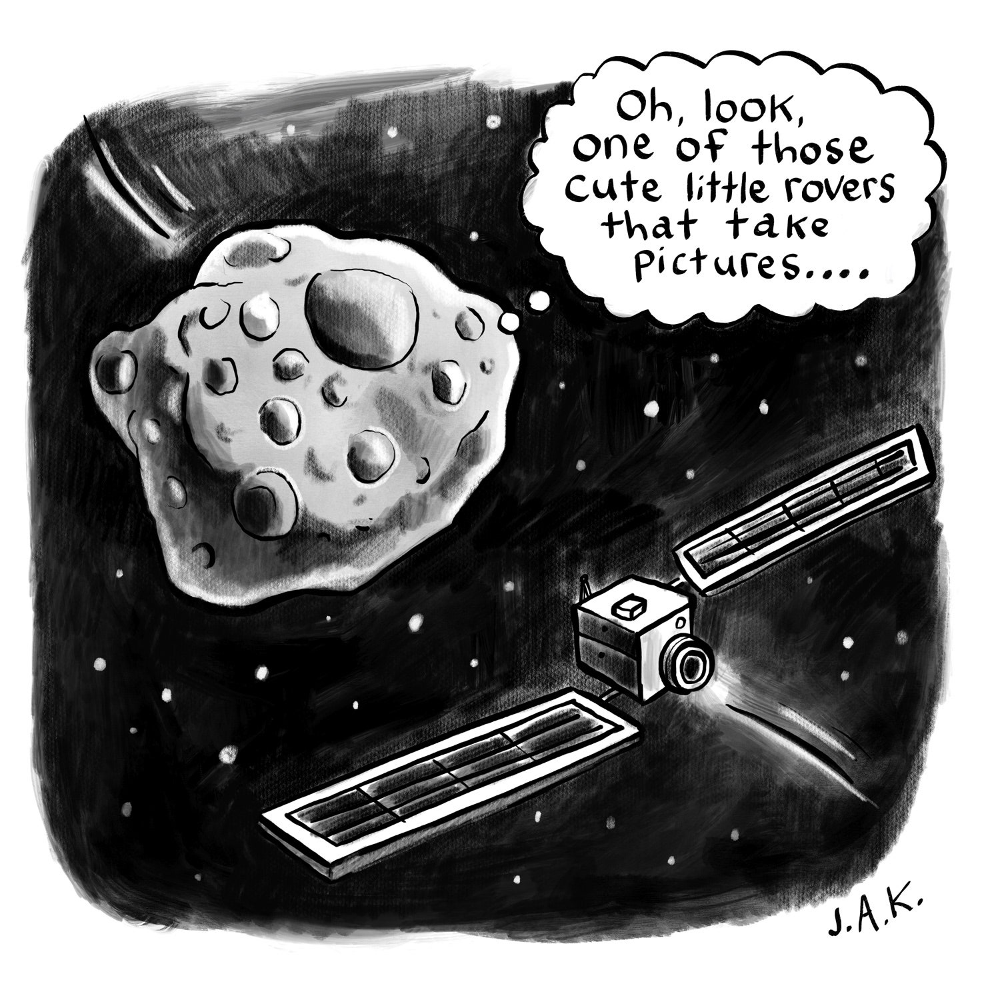
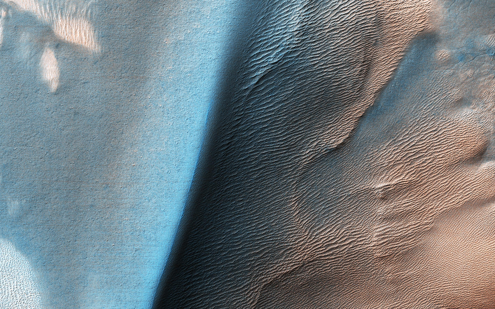
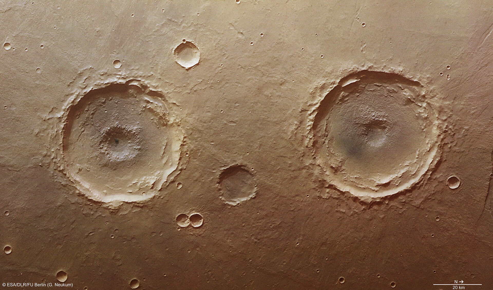
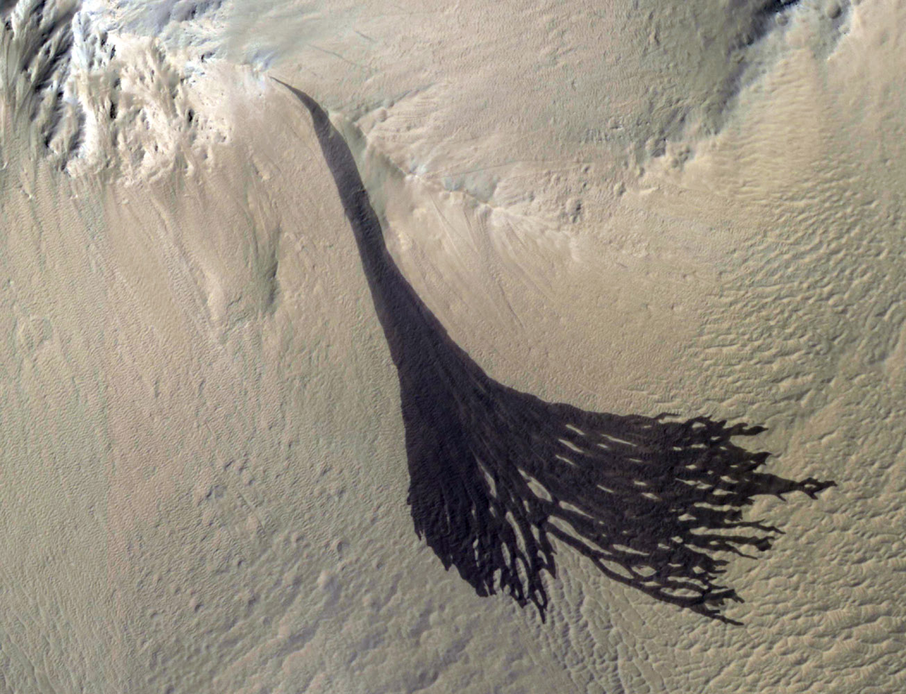
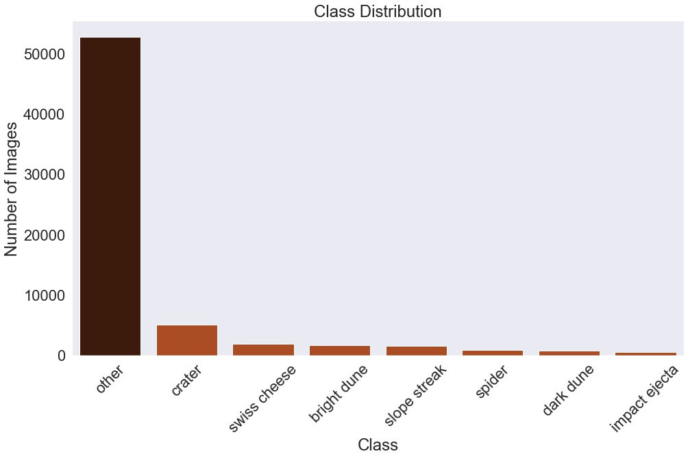
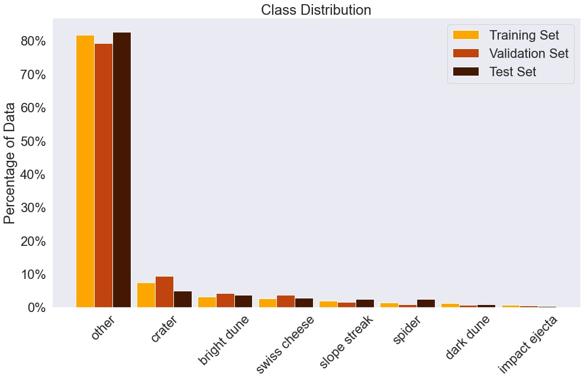
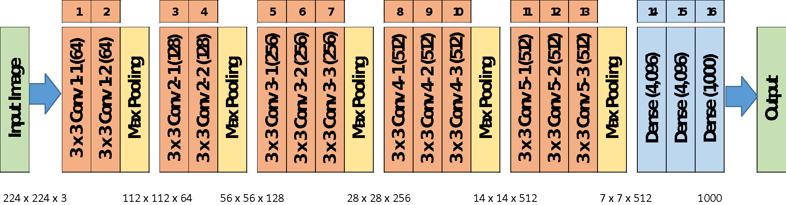
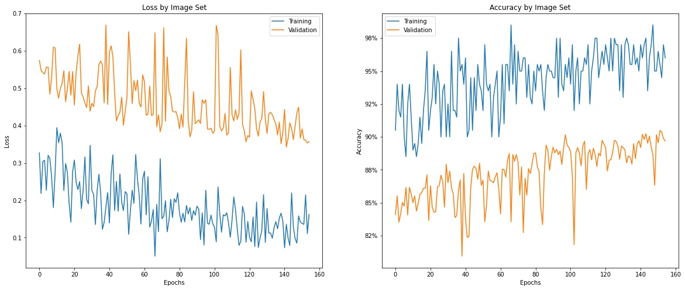
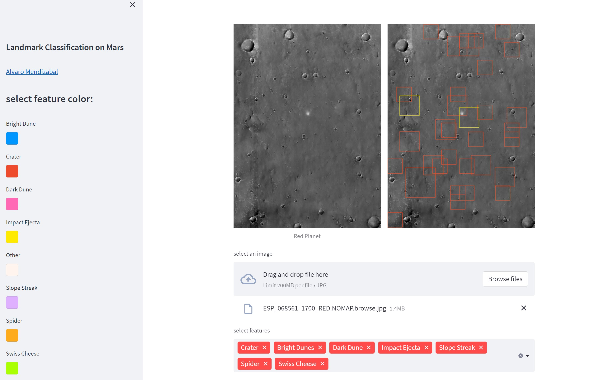

# Landmark Classification on Mars
#### VGG16 neural network trained on images collected by the Mars Reconnaissance Orbiter identifies landmark types on the Red Planet with 91.4% accuracy. 

Alvaro Mendizabal | [LinkedIn](https://www.linkedin.com/in/alvaro-mendizabal/) | [GitHub](https://github.com/alvaromendizabal) | [Email](mailto:alv.mendizabal@gmail.com)


# Business Understanding

The aerospace and defense industry reported $712 billion of revenue in 2021 (up 4% over 2020), and $62 billion of operating profit (up 136%), according to PwC analysis. Recently, NASA smashed it's Dart probe into an asteroid, destoyring itself in the process. The collision was intentional and designed to test whether space rocks that might threaten Earth could be pushed safely out of the way. Reports indicate that the Dart probe was a mere 17 meters off the exact centre of the asteroid. NASA and the aerospace industry are capable of traveling further than they ever have, navigating to specific locations, and capturing photos, recording video and taking samples.

But, <b>"Houston, we have a problem."</b> And it's that there aren't enough scientists to review all the collected images and classify them. We at <b>Image Science and Analysis Group (ISAG)</b> have built a model that <b>"takes one giant leap"</b> over this problem. <b>First</b>, our model can identify 8 landmarks types and contribute to mapping out the terain on Mars. <b>Second</b>, we can also identify other unclassifiable landmarks or features. The images classified as other may foster efforts to select sites of interest to explore during manned or unnmanned missions. At it's core, our model let's us know what we're looking at and if doesn't then it lures to a new place we could go. In this way, image science is part and parcel of <b>space exploration</b> and discovery and our group can help <b>NASA</b> further this mission.

# Data

This [dataset](https://zenodo.org/record/4002935#.Yy3e-KTML30) contains 64,947 landmark images that were detected and extracted from the [High Resolution Imaging Science Experiment](https://www.uahirise.org/) (HiRISE) browse images, spanning 232 different source images. HiRISE is a superpowerful camera onbard the Mars Reconnaissance Orbiter.

This set was built from 10,815 landmarks. Each landmark was cropped to square bounding box that included the full extent of the landmark and a 30-pixel margin to the top, bottom, left, and right. Each landmark was then resized to 227 x 227 pixels. 9,022 of these images were then augmented to generate 6 additional landmarks using the following methods:

1. 90 degrees clockwise rotation
2. 180 degrees clockwise rotation
3. 270 degrees clockwise rotation
4. Horizontal flip
5. Vertical flip
6. Random brightness adjustment

The remaining 1,793 images weren't augmented. Combining these with the (7 * 9,022) 63,154 images,  gives us 64,947 separate images.

## Classes
The various landmarks that make up our 8 classes: 

1.  <b>Dark dune</b> and bright dune are 2 sand dune classes on Mars. Dark dunes are completely defrosted, and bright dunes are not.


2. <b>Bright dunes</b> are typically bright due to overlying frost. Black spots can be seen where parts of the dune are defrosting.


3. <b>Crater</b> class consists of images in which the diameter of the crater is equal to or greater than 1/5 the width of the image plus the circular rim is visible for at least half of the crater's circumference.


4. <b>Slope streak</b> class consists of images of dark flow-like features on slopes. Scientists believe these features were formed by a dry process in which overlying (bright) dust tumbles down a slope and expose a darker sub-surface.


5. <b>Impact ejecta</b> is material that's blasted out from a volcano eruption or meteorite impact. They also include cases in which the impact cleared away overlying dust, revealing the underlying surface. In some cases, the crater isn't be visible because it's too small to see. Impact ejecta may also include lava that poured out from the impact (blobby ("lobate") rather than blast-like), more like an eruption (triggered by the impact). Impact ejecta can be isolated, or they can form in batches when the impactor breaks up into numerous pieces.


6. <b>Spiders</b> and Swiss cheese are phenomena that occur in the south polar region of Mars. Spiders have a central pit with radial troughs, and could be formed due to sublimation of carbon dioxide ice. This process can create mineral deposits on top, which resemble light or dark dust that highlights cracks in the CO2 ice. Spiders can resemble impact ejecta due to their radial troughs, but impact ejecta typically have straight radial jets that get dimmer as they get farther from the center. The spider class also includes fan-like features that form when a geyser erupts through the CO2 layer and the material is blown away from the cracks by the wind. Fans are generally unidirectional (following the wind direction), whereas impact ejecta can fanout in multiple directions.


7. <b>Swiss cheese</b> is a landmark type that includes pits that are formed when the sun heats the ice causing sublimation (change from solid to gas).


8. <b>Other</b> is a catch-all class that contains images that don't fit into any of the classes above. This class comprises the majority of this data.


Our <b>train</b>, <b>test</b>, and <b>validation</b> splits are very <b>imbalanced</b>. Over <b>81%</b>, <b>82%</b>, and <b>79%</b> belong to *'class_type'*  <b>other</b>. A dummy model would perform just as well. Our model must perform better than this.





# Model

## Metrics
We can address the imbalance by using <b>validation accuracy</b> plus <b>validation loss</b> metrics to keep track of our model performance. We are trying to <b>maximize</b> our validation accuracy and <b>minimize</b> our validation loss scores.

## Callbacks

#### CSVLogger
`CSVLogger` callback will create a log file that'll <b>record</b> the model's metrics (<b>loss, accuracy, val_loss, val_accuracy,</b> and <b>learning rate</b>) after every epoch. We'll visualize these metrics below using lineplots.

#### EarlyStop
`EarlyStop` enable us to stop the modeling process early if validation accuracy does not increase after a few epochs. 

#### LearningRateScheduler
We're going to use the `LearningRateScheduler` callback to adjust the model's learning rate while it trains on the data. We don't want our model to have too high of a learning rate otherwise our model may not converge and bounce past the optimal solution. We don't want our learning rate to be too low either because the model will have to train for a longer period of time.  We can address this dilemma with the `LearningRateScheduler`. <b>After 10 epochs</b> the <b>learning rate</b> will <b>decrease</b> after each epoch. This will enable our model to converge and find an optimal solution. 

#### ModelCheckpoint
We'll use `ModelCheckpoint` to <b>save</b> our model after each epoch. We're <b>monitoring</b> the <b>validation accuarcy</b> and ultimately <b>capturing</b> the <b>highest score</b>. When the best validation accuarcy score is beat it's replaced and overwritten. 

## VGG16 
- VGG16 is a type of CNN (Convolutional Neural Network). It can classify 1000 images of 1000 different categories with 92.7% accuracy. It's a popular algorithm for image classification and it's easy to use with transfer learning.<br>
<br>
- The "16" in VGG16 refers to 16 layers that have weights. In VGG16 there are 13 convolutional layers, 5 Max Pooling layers, and 3 Dense layers which add up to 21 layers but it only has 16 weight layers.<br>
<br>
- VGG16 input is an image of dimensions (224, 224, 3).<br>
<br>

<br>
- What's unique about VGG16 is that it uses of a very small 3 x 3 receptive field (filters) throughout the network with the stride of 1 pixel. 2 consecutive 3 x 3 filters provide an effective receptive field of 5 x 5. Likewise, three 3 x 3 filters compensate for a receptive field of 7 x 7. This way, a combination of many 3 x 3 filters can compensate for a receptive area of a larger size.<br>
<br>
- It also significantly lowers the number of weight parameters in the model. For example, the input and output of a three-layer 3 x 3 convolutional stack have C channels, the number of weight parameters are 3 * 32 C2 = 27 C2. Compared to a 7 x 7 convolutional layer, it requires 72 C2 = 49 C2, which is nearly twice the 3 x 3 layers. Furthermore, this can be seen as a regularization on the 7 x 7 convolutional filters forcing them to have a decomposition through the 3 x 3 filters, with non-linearity added in-between via ReLU activations. This lowers the likihood that the model will over-fit while it's training.<br>
<br>

<br>

- Additionaly, Conv-1 Layer has 64 number of filters, Conv-2 has 128 filters, Conv-3 has 256 filters, Conv 4 and Conv 5 has 512 filters.<br>
<br>
- 3 Fully-Connected (FC) layers follow a stack of convolutional layers: the first two have 4096 channels each, the third performs 1000-way ILSVRC classification and thus contains 1000 channels (one for each class). The final layer is the soft-max layer.

# Results
Best performing VGG16 model achieved a <b>validation accuracy</b> score of <b>90.5%</b> and a <b>validation loss</b> score of  <b>0.3622</b>.


Here, we line plot the loss and for the validation and train sets. Our best validaiton accuracy was <b>90.5%</b>, an  <b>11.5%</b> improvement over the dummy model, but we <b>don't see</b> the loss or accuracy reach a <b>good fit</b> point.


Best performing VGG16 model achieved a <b>test accuracy</b> score of <b>91.4%</b> and a <b>test loss</b> score of  <b>0.3928</b>.


# App
We deployed our model in a app hosted by streamlit. You can drop in a image and the app will identify the different landmarks in the image. We can use the app to map the landmarks on new images. When the app identifies a landmark it <b>draws</b> a <b>colored box around</b> the <b>landmark</b>. We can tell which landmark it is because each landmark has been <b>assigned</b> a <b>unique color</b>. This promises to be an efficient and effective classifying technique.
<br>

# Conclusion
Our VGG16 model has performed very well on unseen data. It achieved a <b>loss</b> score of  <b>0.3928</b>. We can predict landmark type on Mars with <b>91.4% accuracy</b>. It's best at predicting the other class. In the future, we could collect more images for the different classes to address the strong imbalance in the data and improve our model's performace. Our <b>model identifies 8 landmarks types</b> and can contribute to mapping out the terain on Mars. We can also identify <b>other unclassifiable landmarks</b> or features. The images classified as other may foster efforts to select sites of interest to explore during manned or unnmanned missions. At it's core, our model let's us know what we're looking at and if doesn't then it lures to a new place we could go. In this way, image science is part and parcel of <b>space exploration</b> and discovery and our group can help <b>NASA</b> further this mission.

# Repository Structure
```
├── data *
├── figures *
├── images *
│     ├── train *
│     |     ├── bright dune *
│     |     ├── crater *
│     |     ├── dark dune *
│     |     ├── impact ejecta *
│     |     ├── other *
│     |     ├── slope streak *
│     |     ├── spider *
│     |     └── swiss cheese *
│     ├── val *
│     |     ├── bright dune *
│     |     ├── crater *
│     |     ├── dark dune *
│     |     ├── impact ejecta *
│     |     ├── other *
│     |     ├── slope streak *
│     |     ├── spider *
│     |     └── swiss cheese *
│     └── test *
│           ├── bright dune *
│           ├── crater *
│           ├── dark dune *
│           ├── impact ejecta *
│           ├── other *
│           ├── slope streak *
│           ├── spider *
│           └── swiss cheese *
├── logs *
├── map * 
├── src  *
│     ├── image_functions.py
│     └── helper_functions.py
|
├── Exploratory_Data_Analysis.ipynb  
├── Notebook.ipynb  
├── README.md
├── presentation.pdf
├── app.py
├── README.md
└── environment.yml

* = files and folders will be created after running the .ipynb files.
```
